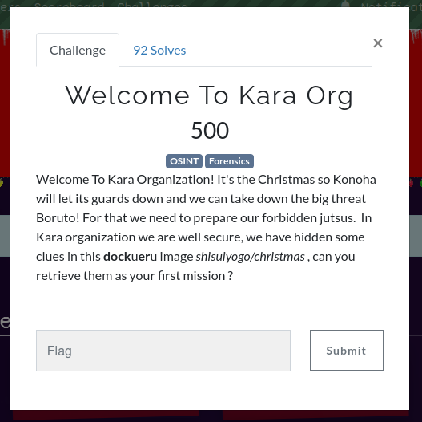
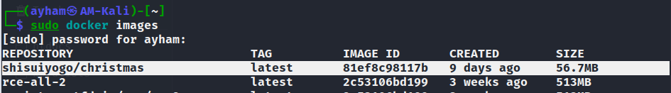
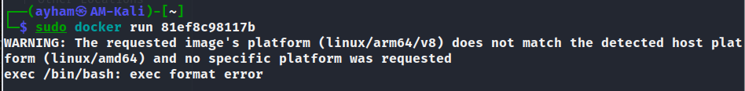
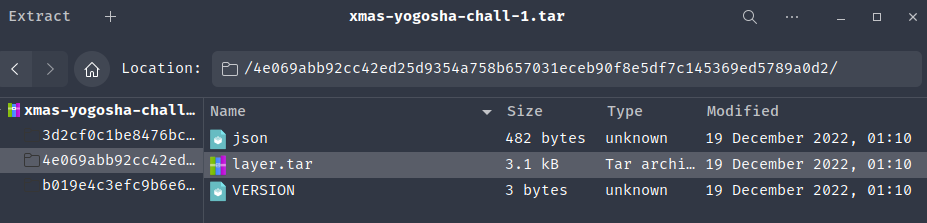
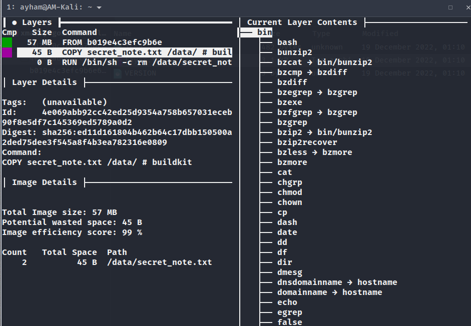
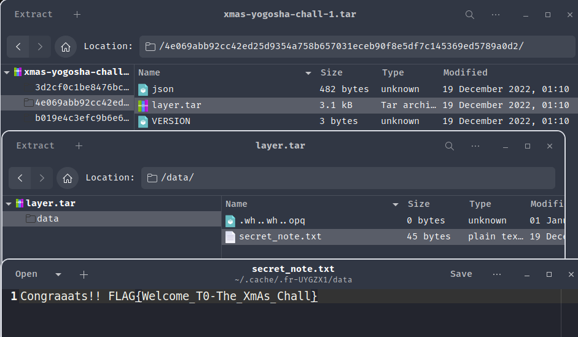

🚩 First Challenge

### Question



### Solution
- Question says it's a **docker** image (`dockueru`) and this is the link `shisuiyogo/christmas` for it
- After downloading you try to run it but you it fails to run
- 
- 
- Since I never saw/solved such chall before I didn't know much what to do
- I started to look for tools to analyze docker images since we actually have the image file and I found this [dive](https://github.com/wagoodman/dive) which basically tells you what the image does (the commands and diff of files/folders)
- From the command we see that it's moving the secret file to another path then deleting it so even if you were able to run it you won't find the file because it was deleted after moving
- 
- I tried to find a way to get that file from the image and with some searching I found that **docker** command actually have a [save](https://docs.docker.com/engine/reference/commandline/save/) command which saves the images files and output it to where you want
-
```bash
docker save IMAGE-ID > OUTPUT.tar
```
- When I opened it I searched through the files and found layers.tar in the second file that has the **secret-note.txt**
- 
- 
- VOILAAAA!!! We got the first flag!
> Flag: `FLAG{Welcome_T0-The_XmAs_Chall}`
