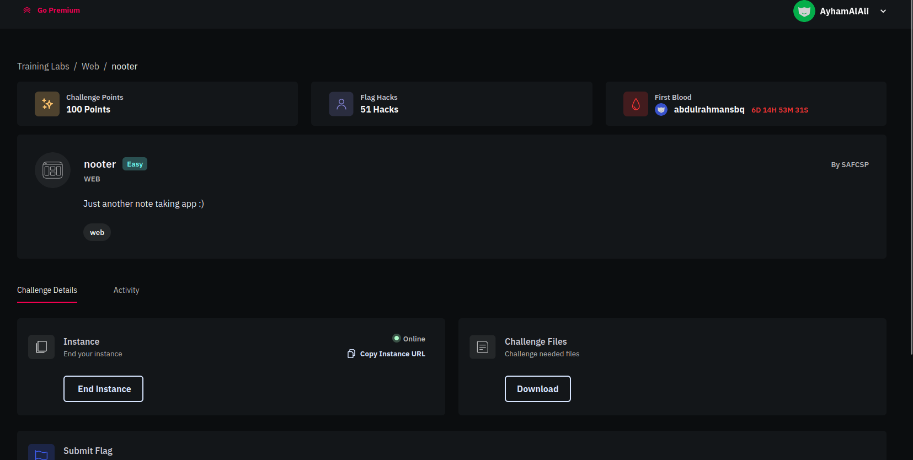
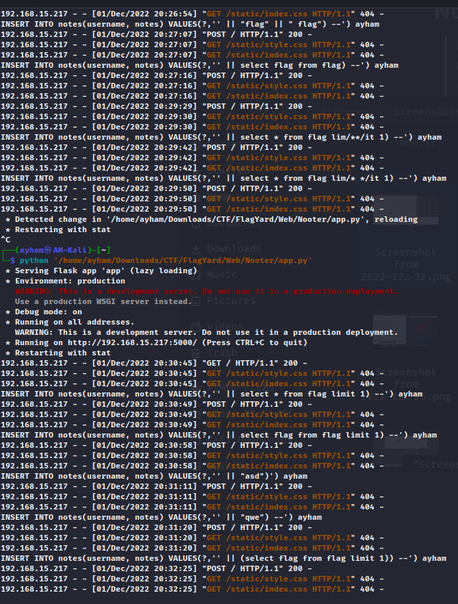
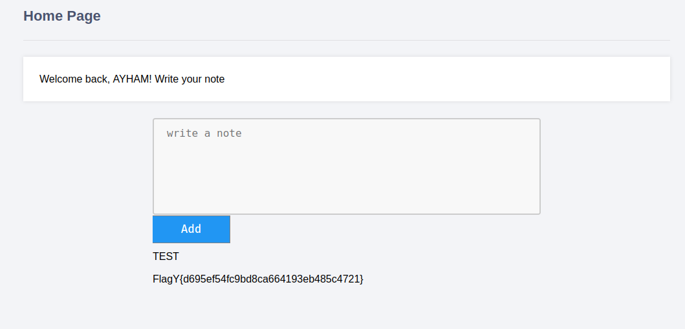

# Nooter

> Difficulty: Easy
> 
> Points: 100
> 
> Just another note taking app :)
> 
> Attachements: app.py
> 
> Chall Link: [Flagyard](https://flagyard.com/labs/training-labs/2/challenges/00c862b7-13cb-4142-8116-3dde550f4daa)



## Solution

- It's a nice little SQL Injection chall

- I saw the code and ran it on my local for some tests since I am not very good at SQL Injection (yet)

- I tried many crafted payloads to understand the exploit well

-   

- The exploit was in the note insert code 

- ```py
  query = db.insert("INSERT INTO notes(username, notes) VALUES(?,'%s')" % note, session['username')
  ```

- And we know the flag is in the database due to this line

- ```py
  db.insert("INSERT INTO flag(flag) VALUES (?)", "FlagY{fake_flag}")
  ```

- As you can see we have to craft a payload that will insert the flag queried from the other db as a note then it will be printed directly with my notes

- The payload I ended up with is (note that `limit 1` is not needed)

- ```py
  ' || (select flag from flag limit 1)) --
  ```

- And VOILAAAA!!

- 

- >  Flag: `FlagY{d695ef54fc9bd8ca664193eb485c4721}`
