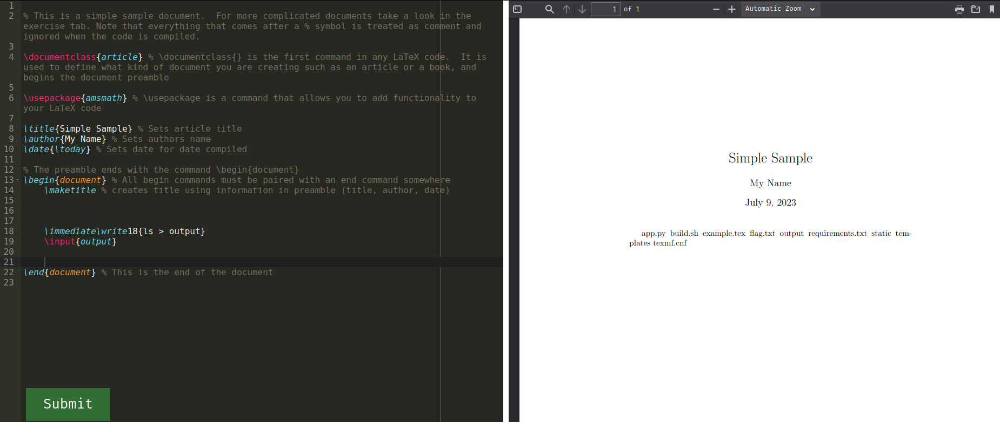
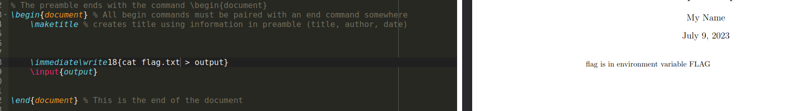
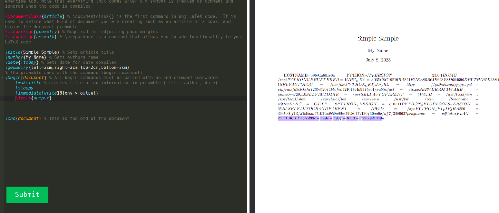
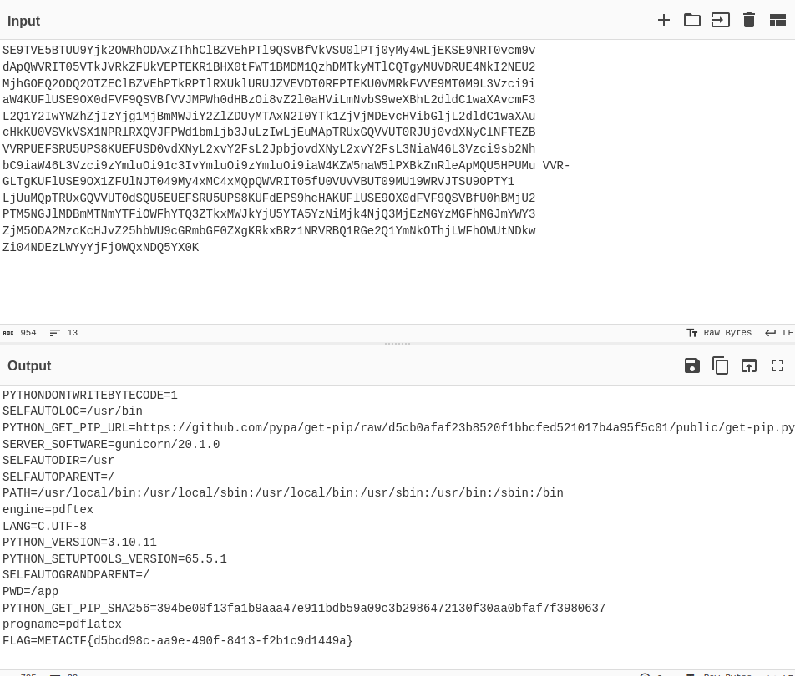

# T3X
### Web - Easy

This is my first time solving a web challenge of this type, it uses Latex parser which is mostly used for math equations and symbols? (I think so)
however, it was pretty easy as there was a straight forward writeup for it online on first search..

- Writeup link: https://deskel.github.io/posts/thm/laxctf
- Basically, you can use `"$$ /input{/etc/passwd} $$"` anywhere in the parser and it will open the provided file for you and print it on the PDF viewer
- Then I found out about `/immediate/write18{COMMAND}` where you can execute commands using it.. so I tried multiple commands such as `ls`
- 
- and I found `flag.txt`I tried to `cat` it 
- 
- so now we know the flag is in the environment variables, linux has this command one of many `env` so you can simply do `env > output` and the `output` file will have the results so we did it!
- 
- However, the flag was messed up due to the syntax of Latex parser, I tried fixing it but it was wrong so I converted it to base64 using `env | base64 > output` and using `base64 -d` I got the flag!
- 
- VOILAAA!!