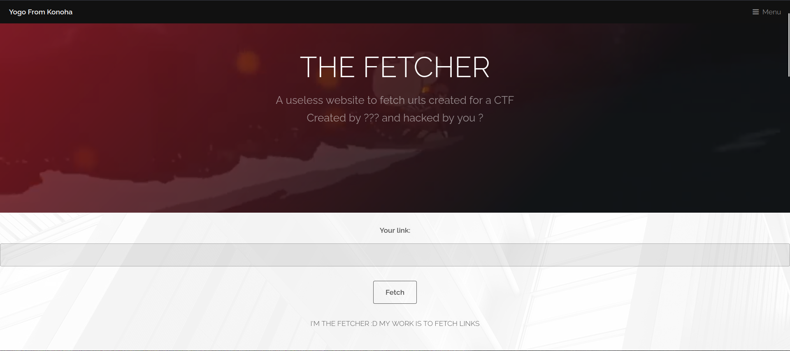
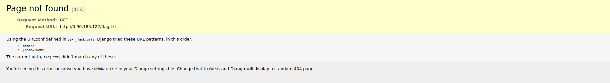
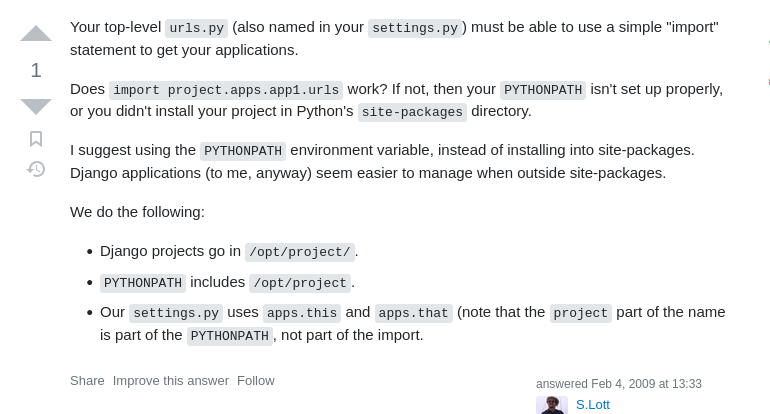
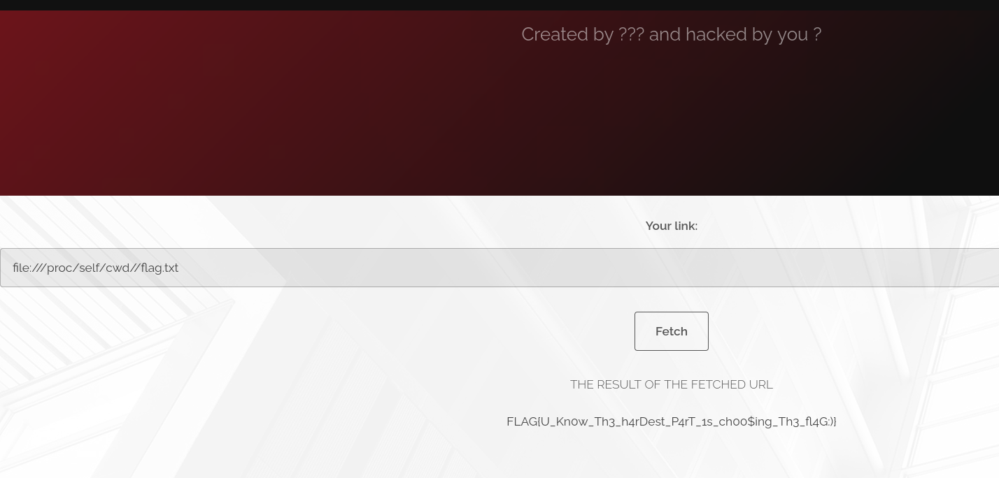

### Question

> Name: The Fetcher
> Couldn't get the question and CTF ended :\
> Points: 500
> Solves: ~10
> 
> Link: http://3.90.185.122/

### Solution

- By looking at the web page we know it's fetching links and printing the result

- 

- The description had a hint saying the flag.txt is in the same directory

- We tried to put `flag.txt` and `http://3.90.185.122/flag.txt` but nothing returns

- Trying to enter `http://3.90.185.122/flag.txt` gives us this result

- 

- From this we can find it says `SSRF_Task.urls` so it's SSRF!

- We tried to see the admin page and did some tests on it but it seemed to be out-of-scope so we left it

- We went back to the main page and tried to write this payload `file:///./flag.txt` but it didn't work

- Then we tried to search for Django app path (got this info from the admin page it says Django Dashboard) we found this answer 

- 

- So it's in `/opt/project/SSRF_Task/flag.txt` we tried that but nope it didn't work!!

- we kept trying abit until we tried this path `/opt/app/SSRF_Task/flag.txt` and it worked!!

- so the payload is `file:///opt/app/SSRF_Task/flag.txt`

- Alternative solution by Admin: `file:///proc/self/cwd//flag.txt`

- 

- Flag: `FLAG{U_Kn0w_Th3_h4rDest_P4rT_1s_ch00$ing_Th3_fl4G:)}`
