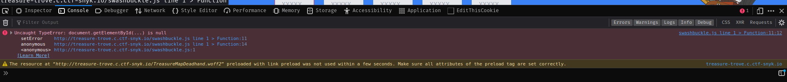
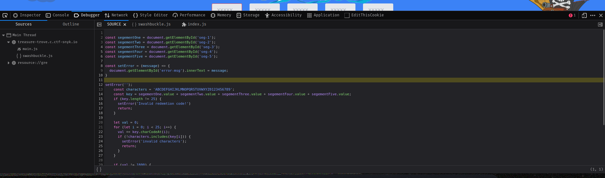

### Treasure Trove

> The latest Treasure Trove is out, but where did I put my licence key!
> 
> Attachements: obfuscator.js
> 
> http://treasure-trove.c.ctf-snyk.io/

### Solution

- First, I opened the link and saw the source code (Ctrl+U) and found couple of js files, one of them is obfuscated (`swashbuckle.js`) (hense the obfuscator.js attachement)

- In somehow (idk if it's intentional) I found a console error in that script `swashbuckle.js` and when I clicked on the error it show me the SOURCE tab! with the deobfuscated code!!!

- 
  
  

- In this case I didn't even need the obfuscator.js! AMAZING!!

- I read the code and understood it and saw that
  
  - It must be 5 segments each segment is made of 5 chars (25 chars in total)
  
  - The code calculated the total ASCII codes addition of all the chars to be = 1800 otherwise it says `Invalid code`

- So after knowing the 2 points above I tried to get a serial number of 25 chars that whem summed up it equals to 1800 (ASCII codes) 

- Quick math! 

- ```v
  1800 / 25 = 72
  ```

- In ASCII table the character of code `72` is `H` soooooo I tried to make a serial of 25 `H`s

- In the deobfuscated code you'll find the API link `fetch('/api/validatekey/' + key)` so it's `/api/validatekey/KEY_HERE`

- So I sumbitted my serial and VOILAAAAA!

- I got this response `{"ok":200,"flag":"SNYK{21f0aba8af31aed49d375d381742f514d1d5271f0d51df5c6b4aab9451f2f9ca}"}`

- > FLAG: **SNYK{21f0aba8af31aed49d375d381742f514d1d5271f0d51df5c6b4aab9451f2f9ca}**
