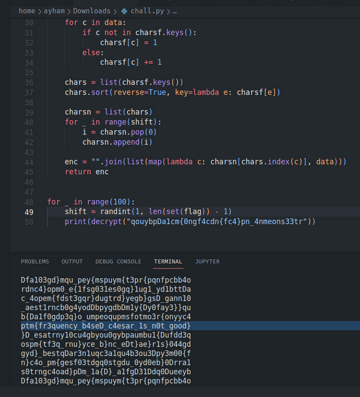

### Question

> Something doesn't seem quite right, someone shifted all my keyboard keys!
> `nc tcp.challs.m0lecon.it 7393`
> Author: `_Rising_`
> Attechements: `chall.py`

### Solution

> I read the code and simply I need to connect to the netcat target and use **option 2**
> I've got the encrypted flag `qouybpDa1cm{0ngf4cdn{fc4}pn_4nmeons33tr`

- From the **encrypt** function it seems to be a caeser cipher in some way so I tried it at dcode.fr but failed :\

- I then got an idea to try the same function to encrypt the encrypted flag and maybe it will be reversed?! LET'S TRY!

- This was the code I tried
  
  ```py
  flag = "qouybpDa1cm{0ngf4cdn{fc4}pn_4nmeons33tr"
  for _ in range(100):
    shift = randint(1, len(set(flag)) - 1)
    print(encrypt("qouybpDa1cm{0ngf4cdn{fc4}pn_4nmeons33tr"))
  ```

- ANNNDDDD!! IT WORKED!! one of the printed flags was the flag!

- 
  
  > Flag: `ptm{fr3quency_b4seD_c4esar_1s_n0t_good}`
